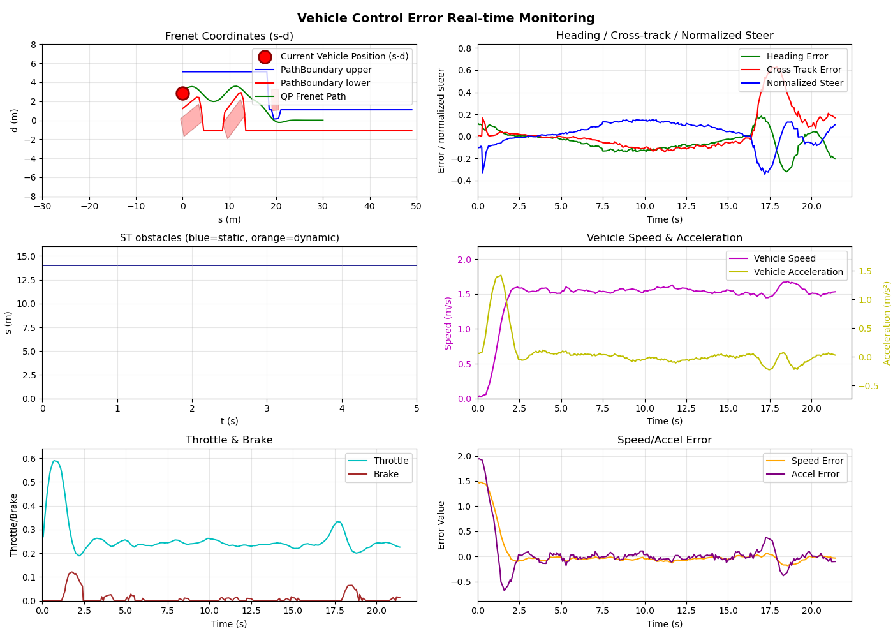
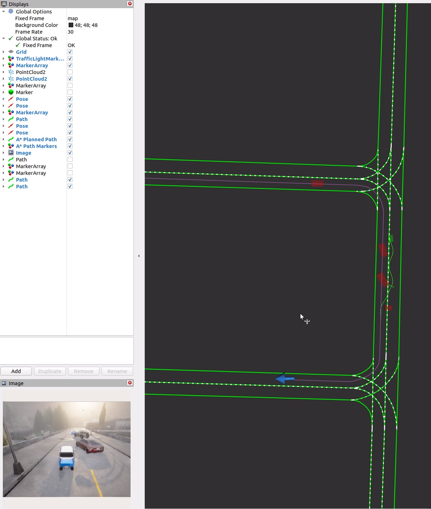

# Intro
See updated_version.txt  

# Ref
> https://github.com/gezp/carla_ros/releases/  
> https://carla.readthedocs.io/projects/ros-bridge/en/latest/  
> https://autowarefoundation.github.io/autoware-documentation/main/tutorials/  
> https://github.com/fzi-forschungszentrum-informatik/Lanelet2/  
> https://github.com/ApolloAuto/apollo/  

# Necessary revision of carla-ros-bridge
See REAL_TIME_FACTOR_CHANGES.md and updated_version.txt(version 2.3)  

# Current effect
https://github.com/user-attachments/assets/95dcb773-babf-4f57-a353-a40c0356a24b  
|   | 
|:--:| 
| *Debug Diagram* |  
|   | 
| *Real-time visuals of Rviz and Carla* | 

---

# In terminal with ros2
```bash
export ROS_DOMAIN_ID=200
```

# Terminal 1, open carla simulator
```bash
cd carla0914/
./CarlaUE4.sh 
```

# Terminal 2, load carla-ros-bridge
```bash
source ~/carla-ros-bridge/catkin_ws/install/setup.bash
ros2 launch carla_ros_bridge carla_ros_bridge.launch.py synchronous_mode:=True town:=Town01
```

# Terminal 3, generate a car
```bash
source ~/carla-ros-bridge/catkin_ws/install/setup.bash
```
## Config of carla is modifiable in _objects.json_
```bash
ros2 launch carla_spawn_objects carla_example_ego_vehicle.launch.py spawn_sensors_only:=False objects_definition_file:=/home/usr/ws/src/vehicle_ctrl/config/objects.json 
```

# Terminal 4, load map
```bash
source ~/ws/install/setup.bash 
ros2 run map_load map_control_node 
```

# Terminal 5, remap goal
```bash
source ~/ws/install/setup.bash 
ros2 run vehicle_ctrl remap_goal
```

# Terminal 6, open rviz
```bash
rviz2 -d src/vehicle_ctrl/rviz2/carla_map_spawn_anywherev2.rviz 
```
```json
// To view the camera feed in Carla, click the 'Image' button on the left sidebar of rviz
// In objects.json
{
    "type": "sensor.camera.rgb",
    "id": "rgb_rear",
    ...
    // The resolution and frame rate of the camera image can be set here
    // In order to ensure the stability of the simulation, sensor_tick >= 0.1 is recommended
    "image_size_x": 400,
    "image_size_y": 300,
    "sensor_tick": 0.2,
    ...
}
```

# Terminal 7, open control/smooth/perception node
```bash
source ~/ws/install/setup.bash 
source ~/carla-ros-bridge/catkin_ws/install/setup.bash
ros2 launch vehicle_ctrl full_system.launch.py
```

# Terminal 8, open the plotter
```bash
source ~/ws/install/setup.bash 
ros2 run vehicle_ctrl vehicle_plotter
```

# Terminal 9, run scenario
```python
# In following_scenario.py
# Subsititude your own carla_simulator path here
sys.path.append(glob.glob('/home/D/carla_simulator/PythonAPI/carla/dist/carla-*%d.%d-%s.egg' % (
    sys.version_info.major,
    sys.version_info.minor,
    'win-amd64' if os.name == 'nt' else 'linux-x86_64'))[0])
```
```bash
cd ~/ws/src/scenario_set && python3.10 following_scenario.py --host localhost --filterv 'vehicle.audi.*' --ahead-distance 5.0 --travel-distance 200.0 --position-jump-threshold 20.0
```
