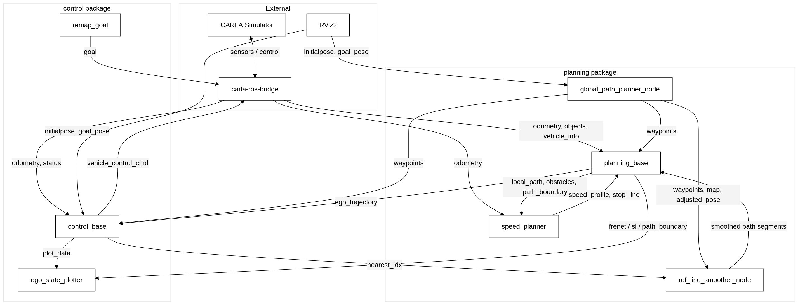

# 系统架构说明

本文档描述本仓库的目录结构、各文件职责，以及模块/节点之间的上下游依赖关系。

---

## 1. 总体架构

系统在 **CARLA 仿真器** 与 **carla-ros-bridge** 之上运行两个自研 ROS2 包：

| ROS 包 | Python 子包 | 职责 |
|--------|-------------|------|
| `planning` | `modified_EM_planner` | 全局路径、参考线平滑、感知/横向规划、纵向速度规划 |
| `control` | `controller` | 车辆控制、状态估计、可视化、目标点转发 |  

|   | 
|:--:| 
| *System Architecture* |

---

## 2. `planning` 包

### 2.1 自定义消息 `planning/msg/`

| 文件 | 作用 | 主要使用者 |
|------|------|------------|
| `FrenetPath.msg` | Frenet 坐标系路径点 | `planning_base` → plotter |
| `SLBoundary.msg` / `SLBoundaryArray.msg` | 障碍物 SL 边界 | `planning_base` → plotter |
| `PathBoundary.msg` | 横向可行域上下界 | `planning_base` → control, plotter |
| `LocalPlanningPath.msg` | 局部路径点 + 走廊弧长 | `planning_base` → `speed_planner` |
| `PlanningObstacle.msg` / `PlanningObstacleArray.msg` | 规划障碍（含决策、轨迹） | `planning_base` → `speed_planner` |
| `PlanningPathPoint.msg` | 路径点（s, x, y, θ, κ…） | 组合进 `LocalPlanningPath` |
| `PlanningSpeedPoint.msg` / `PlanningSpeedProfile.msg` | 速度剖面 (t, s, v, a) | `speed_planner` → `planning_base` |
| `PlanningTrajectoryPoint.msg` / `EgoPlanningTrajectory.msg` | 时空轨迹点 | `planning_base` → `control_base` |
| `STObstacleStamp.msg` / `STGraph.msg` | ST 图障碍与时间轴 | `speed_planner` → plotter |

### 2.2 算法与节点 `planning/modified_EM_planner/`

| 文件 | 作用 | 上游（输入） | 下游（输出/调用） |
|------|------|--------------|-------------------|
| `planning_params_loader.py` | 加载并缓存 `planning_params.json`（`PLANNING_PARAMS` 可覆盖） | `config/planning_params.json` | 所有 planning 节点与 planner 库 |
| `global_path_planner.py` | **全局路径节点**：加载 OSM 地图、A* 拓扑规划、发布 waypoints | RViz 起终点、odometry、rosout（停车检测） | `ref_line_smoother`、`planning_base`、`control_base`；发布 `lanelet2_map` |
| `ref_line_smoother.py` | **参考线平滑节点**：QP 局部平滑、增量更新 waypoints | waypoints、nearest_idx、odometry | `planning_base`、`control_base`（update_index/points） |
| `planning_base.py` | **规划主节点**：障碍投影、PathBoundary、借道决策、横向 QP、轨迹组装 | waypoints、objects、odometry、speed_profile、stop_line、平滑更新 | `speed_planner`（local_path/obstacles）；`control_base`（ego_trajectory）；plotter |
| `speed_planner.py` | **速度规划节点**：ST 图构建、DP 粗解、QP 精化 | `LocalPlanningPath`、`PlanningObstacleArray`、odometry、vehicle_status | `planning_base`（speed_profile）；发布 stop_line、st_graph |
| `local_path_planner.py` | Frenet 横向 jerk-QP（`LocalPathPlanner` 类） | 被 `planning_base` 调用 | 返回 (l, dl, ddl) 解 |
| `st_dp_planner.py` | 纵向 ST 图动态规划（`run_dp_speed_plan`） | 被 `speed_planner` 调用 | DP (t,s,v,a) 折线 |
| `st_qp_planner.py` | 纵向 jerk-QP 精化（`solve_longitudinal_speed_qp`） | 被 `speed_planner` 调用；依赖 DP 粗解 | 细网格 (t,s,v,a) |
| `math_utils.py` | 路径曲率、弧长、角度圆插值、坐标变换等工具函数 | — | `planning_base`、`ref_line_smoother`、`control`（cg_lqr, stanley） |

**规划流水线：**

```
global_path_planner → waypoints
       ↓
ref_line_smoother → 平滑 waypoints
       ↓
planning_base → local_path_planner (横向 QP)
       ↓              ↑
speed_planner ← local_path + obstacles
  ├─ st_dp_planner
  └─ st_qp_planner
       ↓
planning_base → ego_trajectory → control_base
```

---

## 3. `control` 包

### 3.1 控制器与节点 `control/controller/`

| 文件 | 作用 | 上游（输入） | 下游（输出/调用） |
|------|------|--------------|-------------------|
| `control_params_loader.py` | 加载 `carla_control_params.json`（`CONTROL_PARAMS` 可覆盖） | config JSON | `carla_vehicle_control.py` |
| `plotter_params_loader.py` | 加载 `plotter_params.json`（`CONTROL_PLOTTER_PARAMS` 可覆盖） | config JSON | `ego_state_plotter.py` |
| `control_base.py` | **控制节点入口**（`ros2 run control control_base`） | — | 实例化 `CarlaVehicleControl` |
| `carla_vehicle_control.py` | **控制主节点**：EKF 融合、LQR 横向、PID 纵向、CARLA 接口 | ego_trajectory、odometry、vehicle_info/status、waypoints | CARLA 控制指令；nearest_idx → smoother |
| `cg_lqr_controller.py` | 质心自行车模型 LQR 横向控制 | 被 `carla_vehicle_control` 调用；读 `modified_EM_planner.math_utils` | 转向角、速度修正 |
| `stanley_controller.py` | Stanley 横向控制（遗留，主环已用 LQR） | config 中 `stanley` 段（未接入主环） | 可独立调用 |
| `pid_controller.py` | 通用 PID（速度/油门/刹车三环） | 被 `carla_vehicle_control` 调用 | 加速度与油门刹车 |
| `bicycle_model_ekf.py` | 质心自行车 EKF 状态估计 | 被 `carla_vehicle_control` 调用 | 滤波后位姿 |
| `constants.py` | 终端 ANSI 颜色常量 | — | `carla_vehicle_control` |
| `remap_goal.py` | **目标点转发节点**：RViz goal → CARLA | `/goal_pose` | `/carla/ego_vehicle/goal` |
| `ego_state_plotter.py` | **调试绘图节点**：误差曲线、SL 图、ST 图 | plot_data、planning 可视化话题 | matplotlib 窗口 |

**控制流水线：**

```
control_base
    → carla_vehicle_control
        ├─ bicycle_model_ekf (状态估计)
        ├─ cg_lqr_controller (横向 LQR)
        └─ pid_controller ×3 (速度/油门/刹车)
    → /carla/ego_vehicle/vehicle_control_cmd
```

---

## 4. 配置与环境变量

| 环境变量 | 配置文件 | 读取模块 |
|----------|----------|----------|
| `PLANNING_PARAMS` | `planning/config/planning_params.json` | `planning_params_loader.py` |
| `CONTROL_PARAMS` | `control/config/carla_control_params.json` | `control_params_loader.py` |
| `CONTROL_PLOTTER_PARAMS` | `control/config/plotter_params.json` | `plotter_params_loader.py` |
