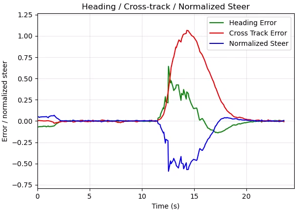
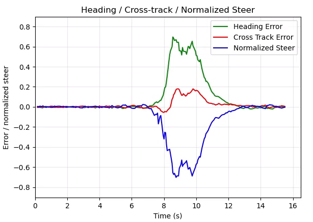

# 质心参考自行车模型 LQR 轨迹跟踪

本文档说明 `vehicle_ctrl/cg_lqr_controller.py` 所采用的运动学模型、线性化与 LQR 设计。实现与 EKF（`bicycle_model_ekf.py`）一致：**参考点为车辆几何中心**，$l_r = L/2$。

---

## 1. 连续运动学模型

状态与控制：

$$
\mathbf{x} = [x_c,\, y_c,\, \theta]^T, \quad \mathbf{u} = [v,\, \delta]^T
$$

$L$：轴距；$l_r$：质心到后轴距离（几何中心时 $l_r = L/2$）。

侧偏角：

$$
\beta(\delta) = \arctan\!\left(\frac{l_r}{L}\tan\delta\right)
$$

合速度方向角 $\psi = \theta + \beta(\delta)$。连续方程：

$$
\dot{x}_c = v\cos\psi, \quad
\dot{y}_c = v\sin\psi, \quad
\dot{\theta} = \frac{v\cos\beta(\delta)\,\tan\delta}{L}
$$

与后轴模型（$\beta=0$）相比，转弯时速度方向与车身纵轴存在侧偏角 $\beta$。

---

## 2. 误差状态 LQR

### 2.1 误差定义

参考轨迹在时刻 $k$ 的量为 $(x_r, y_r, \theta_r, v_r, \delta_r)$（由 `ego_trajectory` 在 $\tau_{\mathrm{plan}}$ 插值得到）：

$$
\mathbf{X} = \begin{bmatrix} x_c - x_r \\ y_c - y_r \\ \theta - \theta_r \end{bmatrix}, \quad
\mathbf{u}_e = \begin{bmatrix} v - v_r \\ \delta - \delta_r \end{bmatrix}
$$

航向误差需归一化到 $[-\pi, \pi]$。

### 2.2 参考量

$$
\beta_r = \beta(\delta_r), \quad \psi_r = \theta_r + \beta_r
$$

$$
\beta'(\delta) = \frac{l_r}{L}\cdot\frac{\sec^2\delta}{1 + (l_r\tan\delta/L)^2}
$$

$$
g(\delta) = \frac{\mathrm{d}}{\mathrm{d}\delta}\bigl[\cos\beta(\delta)\tan\delta\bigr]
= -\sin\beta\,\beta'\tan\delta + \cos\beta\,\sec^2\delta
$$

### 2.3 连续线性化

在参考点一阶展开：

$$
\dot{\mathbf{X}} = \mathbf{A}_c \mathbf{X} + \mathbf{B}_c \mathbf{u}_e
$$

$$
\mathbf{A}_c = \begin{bmatrix}
0 & 0 & -v_r\sin\psi_r \\
0 & 0 &  v_r\cos\psi_r \\
0 & 0 &  0
\end{bmatrix}
$$

$$
\mathbf{B}_c = \begin{bmatrix}
\cos\psi_r & -v_r\sin\psi_r \cdot \beta'(\delta_r) \\
\sin\psi_r &  v_r\cos\psi_r \cdot \beta'(\delta_r) \\
\dfrac{\cos\beta_r\tan\delta_r}{L} & \dfrac{v_r\, g(\delta_r)}{L}
\end{bmatrix}
$$

令 $l_r=0$ 可退化为后轴 LQR 标准形式。

### 2.4 离散化（周期 $T = \texttt{control\_dt}$）

前向欧拉：

$$
\mathbf{A} = \mathbf{I} + T\mathbf{A}_c, \quad \mathbf{B} = T\mathbf{B}_c
$$

$$
\mathbf{X}(k+1) = \mathbf{A}\mathbf{X}(k) + \mathbf{B}\mathbf{u}_e(k)
$$

### 2.5 优化目标与控制律

$$
J = \sum_{k} \left( \mathbf{X}^T\mathbf{Q}\mathbf{X} + \mathbf{u}_e^T\mathbf{R}\mathbf{u}_e \right)
$$

解离散代数 Riccati 方程得 $\mathbf{K}$，控制律：

$$
\mathbf{u}_e = -\mathbf{K}\mathbf{X}
$$

输出：

$$
v_{\mathrm{cmd}} = \mathrm{clip}\bigl(v_r + \Delta v,\, 0,\, v_{\max}\bigr), \quad
\Delta v = \mathrm{clip}(K_{1:}\mathbf{X},\, \pm a_{\max} T)
$$

$$
\delta_{\mathrm{cmd}} = \mathrm{clip}\bigl(\delta_r + \Delta\delta,\, \pm\delta_{\max}\bigr), \quad
\Delta\delta = -K_{2:}\mathbf{X}
$$

权重 $\mathbf{Q}, \mathbf{R}$ 见 `config/carla_control_params.json` 中 `lqr` 段。

---

## 3. 参考量获取

| 量 | 来源 |
|----|------|
| $x_r, y_r, \theta_r, v_r$ | `ego_trajectory` 在 $\tau_{\mathrm{plan}}$ 插值；$\theta$ 用圆插值 `interp_angle_1d` |
| $\kappa_r$ | 对轨迹 $(x,y)$ 序列用 `compute_path_curvatures_triangle` 求离散曲率，再按 $\tau$ 线性插值 |
| $\delta_r$ | 由 $\kappa_r$ 与质心模型迭代求前馈转角（`delta_r_from_kappa`） |

$$
\kappa_r = \frac{\cos\beta_r \tan\delta_r}{L}
\Rightarrow
\delta_r = \arctan\!\left(\frac{L\kappa_r}{\cos\beta_r(\delta_r)}\right)
$$

固定点迭代 2–3 步即可。

---

## 4. 与 Stanley 的结构差异简述

Stanley：

$$
\delta = \theta_e + \arctan\!\frac{k\, e}{v + \varepsilon}
$$

其中 $e$ 为横向误差。该项无显式曲率前馈，输出的转角 $\delta$ 完全依赖误差反馈，大曲率弯道场景容易造成横向响应不足。

LQR：

$$
\delta = \underbrace{\delta_r(\kappa_r)}_{\text{曲率前馈}} + \underbrace{\Delta\delta(\mathbf{X})}_{\text{状态反馈}}
$$

$\delta_r$ 直接由路径曲率给出，弯心段可接近 $\delta_{\max}$；$\mathbf{Q}$ 同时对 $e_x, e_y, e_\theta$ 加权，弯道上横纵耦合修正，利于 U-turn 等大曲率场景抑制偏移。

---

## 5. U-turn 场景效果对比

下图分别为同一 U-turn 场景下 Stanley 与 LQR 的横向误差与归一化转向角时序（控制频率为20Hz）。

|   | 
|:--:| 
| *Effect of U-turn using Stanley* |  
|   | 
| *Effect of U-turn using LQR* | 

**曲线解读与对比**

| 指标 | Stanley（上图） | LQR（下图） |
|------|----------------|-------------|
| 弯道时段 | 约 12–20 s | 约 7.5–13 s |
| Cross Track Error 峰值 | 约 **1.05 m** | 约 **0.18–0.20 m** |
| Heading Error 峰值 | 约 0.65 rad | 约 0.70 rad |
| Normalized Steer 极值 | 约 **−0.6** | 约 **−0.7** |

LQR 横向追踪在以下三点明显优于Stanley

1. **横向偏差量级**：U-turn 弯心段 Stanley 的 Cross Track Error 超过 1 m，而 LQR 全程维持在 0.2 m 以内，约为前者的 **1/5**。U-turn 属于小范围、大曲率机动，Stanley 出现的「弯心偏移大」正是此前仿真中的典型问题。

2. **横向控制量响应力度**：LQR 前轮整体转向更充分，峰值处比 Stanley 转向多出最大转角的 10%（约0.12rad）。Stanley 归一化转向角仅到约 −0.6，物理前轮转角未用足（相当于只用了最大转角的六成）。与第 4 节分析一致。

3. **航向误差与抖动**：两种方案航向误差峰值量级相近（约 0.65–0.70 rad），但 Stanley 航向与横向**不同步**——横向已严重偏离而转向仍不足。